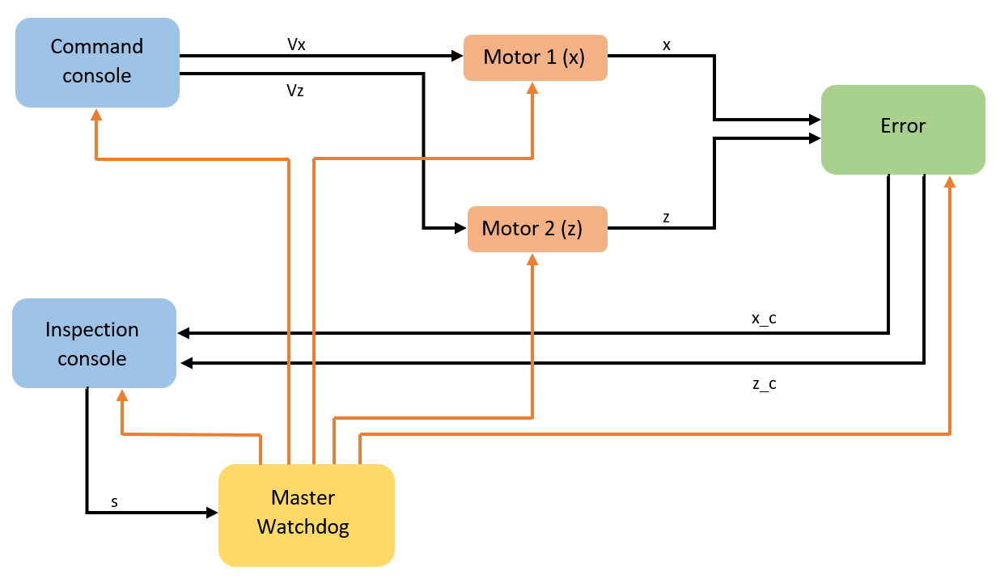

### ARP Crane Assignment
======================================
## Overview:
--------------------------------------
The following project concerns the implementation pf a program that simulates the behavior of a Crane, a 2 d.o.f. system that is controlled by the user using two different consoles.

## How to install the program:
--------------------------------------
It's possible to install the program in two ways:
1. Through the git commands, first of all move to the desired directory where you want to install the software from the terminal, then use the command:
```
git clone https://github.com/jek97/ARP.git
```
2. Directly from the git hub web site downloading the zip file and moving it to the desired directory.
It's also necessary to install the ncurses library, needed for the graphical user interface, for doing that simply open a terminal and type the following command:
```
sudo apt-get install libncurses-dev
```
And the Konsole by opening a terminal and type the command:
```
sudo apt-get -y install konsole
```
## Base Project Structure:
-------------------------------------
Base project structure for the first Advanced and Robot Porgramming (ARP) assignment. The project provides the basic functionalities for the Command and Inspection processes, both of which are implemented through the ncurses library as simple GUIs. In particular, the repository is organized as follows:
* the src folder contains the source code for the master, command console, motor1, motor2, error and inspection console processes.
* the include folder contains all the data structures and methods used within the ncurses framework to build the two GUIs, and the flowchart picture of the project. Unless you want to expand the graphical capabilities of the GUIs (which requires understanding how ncurses works), you can ignore the content of this folder, as it already provides you with all the necessary functionalities.
* The bin folder is where the executable files, together with the log files and named pipes files, are expected to be after compilation.

## Compiling and running the code:
------------------------------------
The command console and the inspection console processes depend on the ncurses library, which needs to be linked during the compilation step. The steps to compile all the processes are:
1. for the master proces:
```
gcc src/master.c -o bin/master
```
2. for the command console:
```
gcc src/command_console.c -lncurses -o bin/command
```
3. for the motor 1:
```
gcc src/motor1.c -o bin/motor1
```
4. for the motor 2:
```
gcc src/motor2.c -o bin/motor2
```
5. for the error proces:
```
gcc src/error.c -o bin/error
```
6. for the inspection console:
```
gcc src/inspection_console.c -lncurses -o bin/inspection
```
After compiling, you can simply run the master executable, which will be responsible of spawning all the processes, to do that move on the folder first_assignment from the terminal and type the command:
```
./bin/master
```
## Software Architecture and working principle:
-------------------------------------------
The program is diveded in six processes that work together to simulate a portal crane as we can see from the flowchart below, all the processes have a different purpose and structure that will be analized soon:
.
Inside the drawing we can distingush between the processes, rapresented by the colored boxes, the named pipes rapresented by the black arrows and the signals rapresented by the orange arrows.
When the master is launched, it first create the directories needed to store the log files (log_files) and the named pipes (named_pipes), then it launch the other processes and create all the named pipes.
Then in run time through the command console is possible to increase, stop and decrease both the speeds along the x axis (horizontal one) and z axis (vertical one) of the crane end-effector by clicking the corresponding button.
The commands are sended rispectively to the motor 1, to control the velocity along x, and motor 2, to control the velocity along z, respectively through the pipes Vx and Vz; each of the motors will compute the position of the end-effector and send it to the error process through the pipes x and z.
At this moment we suppose that the encoder of the crane, simulated by the motor processes, are affected by a random error and to solve it we can use the error process which will sum a random number to simulate this fact.
The resulting position is then sended through the pipes x_c and z_c to the inspection console that will show the crane, the end-effector position, a random red target and two buttons.
The two buttons purpose are to stop the end-effector, by the red stop button, and reset its position by the orange reset button; to do that the inspection console will communicate with the master through the pipe s asking him to send the desired signal to the motors.
This choice of communicating first with the master and then send the signals was forced by the needs of having the proceses pid, in this way the architecture of the program is semplified and the action can be performed without errors, even if in a real situation it may results in a waste of time between the click of the button and the actual stop of the end-effector that for safety reasons is not optimal.
Another possible solution for that problem was to communicate at the beginning the pid of the desired processes from the master to the inspection consoles and then send the signals directly from there, this would increase the complecity of the architecture and leads to multiple errors, by the way an example of it can be found on the on_inspection_signals.
In run time the master proces contineu to check for the inspection console signals and act also as a watchdog by checking the last time the log files of each proces were updated, if one proces hasn't updated its log files in the last 60 seconds, the watchdog send a signal to all the processes to close them.

## Processes architectures:
---------------------------------
# master:
Inside the master we can distinguish three defined functions:
* mkpipe: this function has the purpose of opening in a safe mode a given named pipe:
```
int mkpipe(const char *pathname, mode_t mode) { // function to create a named pipe
  int pipe; // declare the returned valeu of the mkfifo funtion
  int rm_pipe; // declare the returned valeu of the removing function
  remove(pathname); // remove any previous pipe with the same name
  pipe = mkfifo(pathname,mode); // actually create the pipe
  if(pipe < 0) { // checking possible errors
    perror("error while creating the named pipe");
    return -1;
  }
  else {
    return 1;
  }
}
```
The desired pipe pathname and mode are specified by the functions arguments, then the function will remove any already existing FIFO with the same pathname, to avoid errors while creating the new one; creating the desired pipe and check errors in the process.
If no errors occur the function return 1, otherwise -1.

* spawn: this function has the purpose of spawning in a safe mode a given proces:
```
int spawn(const char * program, char * arg_list[]) {

  pid_t child_pid = fork();

  if(child_pid < 0) {
    perror("Error while forking...");
    return -1;
  }

  else if(child_pid != 0) {
    return child_pid;
  }

  else {
    if(execvp (program, arg_list) == 0);
    perror("Exec failed");
    return -1;
  }
}
```
The desired proces pathname together with the argument list array are passed to the function as arguments, the proces then will fork, creating a copy of the current proces, will check any error and execute the desired program. in the end the function will return 1 in case of succes and -1 in case of errors.

* logger: this function has the purpose of writing a log message in the desired log file both specified by the arguments of the function.
```
int logger(const char * log_pathname, char log_msg[]) {
  int log_fd; // declare the log file descriptor
  char log_msg_arr[strlen(log_msg)+11]; // declare the message string
  float c = (float) (clock() / CLOCKS_PER_SEC); // evaluate the time from the program launch
  char * log_msg_arr_p = &log_msg_arr[0]; // initialize the pointer to the log_msg_arr array
  if ((sprintf(log_msg_arr, " %s,%.2E;", log_msg, c)) < 0){ // fulfill the array with the message
    perror("error in logger sprintf"); // checking errors
    return -1;
  }

  if ((log_fd = open(log_pathname,  O_CREAT | O_APPEND | O_WRONLY, 0644)) < 0){ // open the log file to write on it
    perror(("error opening the log file %s", log_pathname)); // checking errors
    return -1;
  }

  if(write(log_fd, log_msg_arr, sizeof(log_msg_arr)) != sizeof(log_msg_arr)) { // writing the log message on the log file
      perror("error tring to write the log message in the log file"); // checking errors
      return -1;
  }

  close(log_fd);
  return 1;
}
```
This function create an array where it will store the message specified by the argument log_msg[] and the time that will be obtained by the clock() function from the launch of the proces, both the information are then putted together with the function sprintf() in that array, error will be checked, the corresponding log file specified by its pathname will be opened, the message will be written on it and then the log file will be closed.
The function will return 1 if no error is detected or -1 in case of errors.
NOTE: this function will be used also in the others processes to print log messages in the log files.

After the definition of these functions the main will begin:
At it beginning the variable needed for the proces are declared of initialized, between them we can distinguish the variables for:
* Create/Open the log_files and named_pipes folders.
* Write down the log messages and check the log files for the watchdog.
* Create the pipes.
* Spawn the processes.
* Menage the signal to send for the inspection console.
* Control the processes by the watchdog.
* Close the processes.
Then first of all the direcories log_files, named_pipes are checked to see if they already exists and otherwise are created.
Any previous log_file of the master is removed, this choice has been done to maintain the log messages only of the last/current execution of the proces.
The legen of all the log messages is written in the log file.
The pipes are opened, the result is checked for errors and a log message is written.
The processes are spawned and the result is controlled and logged.
The pipe used from the inspection console to communicate with the master is opened, and a infinite while start.
In it the named pipe s is checked for messages from the inspection console, in case of messages the right signal is sended to the two motors.
After that the watchdog first obtain the information of the log files of the processes and store them in the respective struct, then the actual time is obtained and the difference between the two times is checked for all the processes.
In case the difference is lower then 60 seconds nothing happend and the while loop will start again, otherwise the master will send a killing signal to all the processes that will persorm the closure, the proces contineus exiting from the while loop and waiting for all the processes to return theyr closure status that will be displayed on the terminal, the master close the named pipe s and close itself.
 
# command_console:
In this proces we can recognize how at its beginning some variable are defined in a global way since these variables will be needed not only inside the main but also in the signal handler for the closure operation.
The logger function is then declared together with the signal handler outside the main:
```
void sig_handler(int signo) {
    if (signo == SIGTERM) {
        if (close(Vx_m1) < 0) { // close the pipe Vx
            perror("error closing the pipe Vx from command"); // checking errors
        }
        if (close(Vz_m2) < 0) { // close the pipe Vz
            perror("error closing the pipe Vz from command"); // checking errors
        }
        if (unlink(Vx) < 0) { // delete the file name from the system of the pipe Vx
            perror("error deleting the pipe Vx from command"); // checking errors
        }
        if (unlink(Vz) < 0) { // delete the file name from the system of the pipe Vz
            perror("error deleting the pipe Vz from command"); // checking errors
        }
        if (raise(SIGKILL) != 0) { // proces commit suicide
            perror("error suiciding the command"); // checking errors
        }
    }
}
```
The signal handler, after receiving the signal SIGTERM from the master, will close all the pipes opened inside the main and unlink them deleting their file name for the system, after that it will kill the proces by sending the SIGKILL signal.
Once we wnter in the main some variables are declared or initialized, between them we can distinguish the variables needed for:
* Writing the commands decrease velocity (0), stop (1), increase velocity (2) on the pipes Vx and Vz respectively between the command console and the motor 1 and the command console and the motor 2.
* Write the log messages.
Done that the signal function is called to recognize input signals and, if equal to SIGTERM, stop the actual routine and start the signal handler one.
The old log file is deleted and the new one is created with the legend of the possible messages.
The console is initialized and the pipes Vx and Vz are opened, this operation is checked for errors and a log message is written.
Then the infinite while loop begins, in it some instructions are used to refresh the console in case of resizing, and then by a series of if/else if the pressed button is checked, discriminating between the cases:
* Vx-- has been pressed: in this case the message 0 is written on the pipe Vx to motor1, possible errors are checked and a log message is written. Then the program wait one second to avoid multiple clicking of the button.
* Vx=0 has been pressed: in this case the message 1 is written on the pipe Vx to motor1, possible errors are checked and a log message is written. Then the program wait one second to avoid multiple clicking of the button.
* Vx++ has been pressed: in this case the message 2 is written on the pipe Vx to motor1, possible errors are checked and a log message is written. Then the program wait one second to avoid multiple clicking of the button.

* Vz-- has been pressed: in this case the message 0 is written on the pipe Vz to motor2, possible errors are checked and a log message is written. Then the program wait one second to avoid multiple clicking of the button.
* Vz=0 has been pressed: in this case the message 1 is written on the pipe Vz to motor2, possible errors are checked and a log message is written. Then the program wait one second to avoid multiple clicking of the button.
* Vz++ has been pressed: in this case the message 2 is written on the pipe Vz to motor2, possible errors are checked and a log message is written. Then the program wait one second to avoid multiple clicking of the button.
covered all the possible cases the console refresh itself and re-start the loop.

# motor1:
First of all some global variables are declared or initialized, they will be used in the signal handler which in this case will take care of multiple signals:
```
void sig_handler (int signo) {
    if (signo == SIGUSR1) { // stop signal received
        Vx_i = 0; // set the velocity to 0
        sleep(1);
       
    }
    else if (signo == SIGUSR2) { //reset signal received
        Vx_i = 0; // set the velocity to 0
        x_i = -0.1; // set the position x to 0, thanks to the error proces also
        sleep(1);
    }
    else if (signo == SIGTERM) {
        if (close(Vx_m1) < 0) { // close the pipe Vx
            perror("error closing the pipe Vx from motor1"); // checking errors
        }
        if (close(x_m1) < 0) { // close the pipe x
            perror("error closing the pipe x from motor1"); // checking errors
        }
        if (unlink(Vx) < 0) { // delete the file name from the system of the pipe Vx
            perror("error deleting the pipe Vx from motor1"); // checking errors
        }
        if (unlink(x) < 0) { // delete the file name from the system of the pipe x
            perror("error deleting the pipe x from motor1"); // checking errors
        }
        if (raise(SIGKILL) != 0) { // proces commit suicide
            perror("error suiciding the motor1"); // checking errors
        }
    }
}
```
indeed this time the signal handler will check for the signals:
* SIGUSR1: that will be received to stop the motors, in this case the sub routine of the handler will set the velocity of the motor to 0 and will wait one second.
* SIGUSR2: that will be received to reset the simulation, in this case the sub routine will set again the velocity of the motor to 0 and also set the position to 0 and will wait for one secondl.
* SIGTERM: that will be received to close the proces, with this aim the pipes Vx and x are closed and unlinked and then the proces will close itself by sending the signal SIGKILL to itself.
Then also the logger function is defined.
entering the main some variables are defined, we can distinguish between:
* Variables used for receiving and sending the messages, where is important to note that we will send a float variable for the position x, requiring to define an array to store that variable of at least 4 bytes/positions.
* Variables used for writing the log messages.
Done that, as for the other programs the previous log file is deleted and a new one is created with the leggend of the log messages.
The signals functions are called for handling the possible received signals, on that operation the errors are checked and in case of fail a log message is written.
Then the pipe Vx in input and x in output are opened and the infinite while loop start:
In it the pipe Vx is read and:
* if no messages are received the position is incremented under the effect of the previous costant velocity.
* if an error occur the same behavior is replicated, hoping to not have the same error in the next iteration.
* if a message is received the corresponding operation is done by modify the velocity, evaluate the new position and wait the time period T to simulate the behavior of a real engine.
After all of that the resulting poisition is controlled to avoid surpassing the crane boundary along x of 40 units (10 for the z one).
in the end the obtained position is sended through the pipe x to the error proces.

# motor2:
This proces work exactly as the motor1 for controlling the velocity and position along the z direction.

# error:
in this proces some global variables required for the signal hanler are declared and/or initialized together with the logger function and the signal handler itself:
```
void sig_handler (int signo) {
    if (signo == SIGTERM) {
        if (close(x_e_in) < 0) { // close the pipe x
            perror("error closing the pipe x from error proces"); // checking errors
        }
        if (close(z_e_in) < 0) { // close the pipe z
            perror("error closing the pipe z from error proces"); // checking errors
        }
        if (close(x_e_out) < 0) { // close the pipe x_c
            perror("error closing the pipe x_c from error proces"); // checking errors
        }
        if (close(z_e_out) < 0) { // close the pipe z_c
            perror("error closing the pipe z_c from error proces"); // checking errors
        }
        if (unlink(x) < 0) { // delete the file name from the system of the pipe x
            perror("error deleting the pipe x from error proces"); // checking errors
        }
        if (unlink(z) < 0) { // delete the file name from the system of the pipe z
            perror("error deleting the pipe z from error proces"); // checking errors
        }
        if (unlink(x_c) < 0) { // delete the file name from the system of the pipe x_c
            perror("error deleting the pipe x_c from error proces"); // checking errors
        }
        if (unlink(z_c) < 0) { // delete the file name from the system of the pipe z_c
            perror("error deleting the pipe z_c from error proces"); // checking errors
        }
        if (raise(SIGKILL) != 0) { // proces commit suicide
            perror("error suiciding the error proces"); // checking errors
        }
    }
}
```
as for the command console the signal handler will close and unlink all the named pipes, that this time will be x, z, x_c and z_c where x_c and z_c are the pipe to send the corrected position to the inspection console; then it will kill the proces.
moved inside the main some other variables are defined, between them we can distinguish the varaiables for:
* Receive and send the position along x and z.
* Menage the signals in input through a select() function.
* Compute and add the error.
* Read and Write on the pipes.
* Write log messages.
Then as for the other processes the previous log file is deleted and the new one is created, adding also the log messages legend.
the signal() function is called to menage the received signal.
all the FIFOs are opened, both the ones in input that the one in output, and the nfds variable is setted for the select.
Then the infinite loop begins: in it the set of file descriptor is cleared and fulfilled again with the input file descriptors, the time interval of the select is setted and the select() function performed.
After that the named pipe ready for a reading operation is read and for both x and z the following operation is performed:
```
                    // pick the received valeu
                    x_e_i = x_rcv[0];

                    if (x_e_i == x_prev) {
                        x_e = x_e_prev; // maintain the previous error
                    }
                    else {
                        // setting up the random variables
                        e = ((rand() % (100 + 1)) - 50) / 100.00; // compute the error
                        x_e = x_e_i + e;
                    }
                    x_prev = x_e_i; // setting the valeu of x for the next iteration
                    x_e_prev = x_e; 

                    logger(log_pn_error, "0010"); // write a log message

                    if (x_e > 40){
                        x_e = 40;
                        logger(log_pn_error, "0011"); // write a log message
                    }
                    else if (x_e < 0) {
                        x_e = 0;
                        logger(log_pn_error, "0100"); // write a log message
                    }
```
the position received for the motor is read, if it's equal to the previous ones it means that the respective motor is stopped and the position is not changing, this leads to avoid another computation of the error and maintaining the last position affected by the previous errors.
Otherwise if the position changed the new error is evaluated, by adding a random number between -1 and 1 to the position.
This logic avoid to recompute at each loop a different error in case the end-effector of the crane is fixed, showing an end-effector that is actually fixed in space respect the time.
Then the obtained position is checked again to control that it doesn't exceed the crane bounds and finally is sended through the correct pipe.

#inspection_console:
In it some global variables, required by the signal handler are defined together with the logger funtion and the signal handler itself, which will work as the previous one, by closing and unlinking the x_c, z_c and s pipes and then kill the process itself.
Then inside the main the variables for receiving the position of the end-effector and sending the signal message along the pipe to the master are declared, together with the select ones, some internal ones and the log message ones.
After that the previous log file is deleted and the new one is created adding also the log messages legend, the console is initialized and the signal() function is called to check possible incoming signals.
The pipes, x_c, z_c and s, are opened and the nfds for the select is setted.
Starting the inifinite while loop the select is performed with the correlated operations between the input pipes, to obtain the position of the end-effector that will be displayed.
Done that the console is controlled to possible input/click of the user on the two buttons, if the stop one is pressed than the message 0 is sent to the master, otherwise if the reset one is pressed the message 1 is sent to the master, both through the s pipe.
In conclusion the console is updated. 

## Troubleshooting
--------------------------------------------------------
you should experience some weird behavior after launching the application (buttons not spawning inside the GUI or graphical assets misaligned) simply try to resize the terminal window, it should solve the bug.
there is no quitting button, if you want to close the program type on the terminal ctrl+c, otherwise wait for 60 seconds to let the watchdog kill all the processes, in this case you should see some errors on the terminal that come from the unlink() function in the signal handler of the varius processes, they depend on the closing order/time of the different processes and can't be solved, by the way it will not be a problem since all the processes will be closed.
