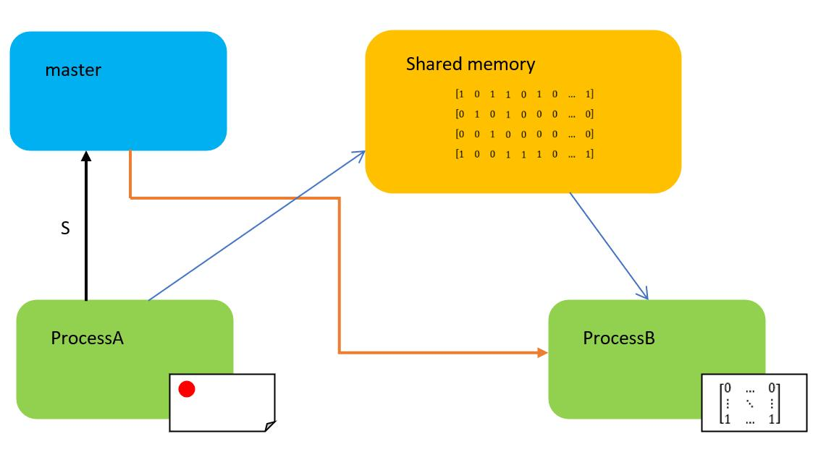
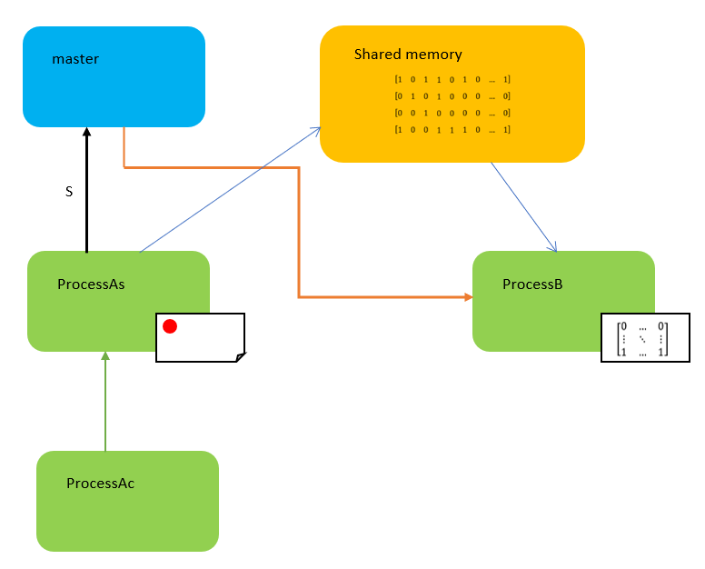

# ARP Visual Inspection System Assignment
--------------------------------------
## Overview:
--------------------------------------
The following project concerns the implementation of a simulator of a visual inspection system under which some objects pass over a conveyor and are detected from the system, more in details the camera aquire the view of the conveyor, simulated by the processA, on each frames a computer vision process, simulated by the processB, try to recognize the object center that then will be displayed in a window together with its history ( all the positions of the center from the launch of the program).

## How to install the program:
--------------------------------------
It's possible to install the program in two ways:
1. Through the **git commands**, first of all move to the desired directory where you want to install the software from the terminal, then use the command:
```
git clone https://github.com/jek97/ARP.git
```
2. Directly from the **git hub web site** downloading the zip file and moving it to the desired directory.
It's also necessary to install the ncurses library, needed for the graphical user interface, for doing that simply open a terminal and type the following command:
```
sudo apt-get install libncurses-dev
```
The Konsole by opening a terminal and type the command:
```
sudo apt-get -y install konsole
```
And the *libbitmap* library, following the steps:
1. Download the source code from [this GitHub repo](https://github.com/draekko/libbitmap.git) in your file system.
2. Navigate to the root directory of the downloaded repo and run the configuration through command ```./configure```. Configuration might take a while.  While running, it prints some messages telling which features it is checking for.
3. Type ```make``` to compile the package.
4. Run ```make install``` to install the programs and any data files and documentation.
5. Upon completing the installation, check that the files have been properly installed by navigating to ```/usr/local/lib```, where you should find the ```libbmp.so``` shared library ready for use.
6. In order to properly compile programs which use the *libbitmap* library, you first need to notify the **linker** about the location of the shared library. To do that, you can simply add the following line at the end of your ```.bashrc``` file:
```export LD_LIBRARY_PATH="/usr/local/lib:$LD_LIBRARY_PATH" ```
## Base Project Structure:
-------------------------------------
Base project structure for the Third Advanced and Robot Porgramming (ARP) assignment. The project provides the basic functionalities for the two processes, both of which are implemented through the ncurses library as simple GUIs and the libbitmap to work with images. In particular, the repository is organized as follows:
* the **src** folder contains the source code for the master, processesA, processAs, processAc and processB processes.
* the ***include** folder contains all the data structures and methods used within the ncurses framework to build the two GUIs, and the flowchart picture of the project. Unless you want to expand the graphical capabilities of the GUIs (which requires understanding how ncurses works), you can ignore the content of this folder, as it already provides you with all the necessary functionalities.
* The **bin** folder is where the executable files, together with the log files and named pipes files, are expected to be after compilation.
* the **out** folder is where the saved snapshot of the shared memory will be stored.

## Compiling and running the code:
------------------------------------
The processA with its variations and processB depend on the ncurses and the libbitmap library, that need to be linked during the compilation step. The steps to compile all the processes are:
1. move to the folder third_assignment.
2. for the master proces:
```
gcc src/master.c -o bin/master
```
3. for the processA (normal mode):
```
gcc src/processA.c -lbmp -lm -lncurses -pthread -lrt -o bin/processA
```
3.1 for the processA (server mode):
```
gcc src/processAs.c -lbmp -lm -lncurses -pthread -lrt -o bin/processAs
```
3.2 for the processA (client mode):
```
gcc src/processAc.c -lbmp -lm -lncurses -pthread -lrt -o bin/processAc
```
4. for the processB:
```
gcc src/processB.c -lbmp -lm -lncurses -pthread -lrt -o bin/processB
```
After compiling, you can simply run the master executable, which will be responsible of spawning all the processes and will ask the user to choose in which modality open the processA, to do that move on the folder second_assignment from the terminal and type the command:
```
./bin/master
```
## Software Architecture and working principle:
-------------------------------------------
The simulator is organized in three different processes that work together to simulate the visual inspection system, as we can see from the flowchart below, all the processes have a different purpose and structure that will be analized soon:


Inside the drawing we can distingush between the **processes**, rapresented by the colored boxes, the **shared memory** rapresented by the yellow box, the **named pipes** rapresented by the black arrows, the **socket** rapresented by the green arrows and the **signals** rapresented by the orange arrows.
When the master is launched, it first create the directories needed to store the log files *log_files* and the named pipes *named_pipes*, then it will ask the user to choose in which modality open the processA and finally it will launch the other processes and create all the named pipes.
the choice between the processes A is the following:
1. processA: will open the processA in normal mode, in this case both the processA and processB will be lunched and it will be possible to control the position of the object on the conveyor directly form processA by using the arrows keys.
2. processAs: will open the processA in server mode, in this case both the processAs and processB will be lunched and it will be possible to control the position of the object on the conveyor by the processAc that will replace the arrows keies of the processA in normal mode sending the command throught the socket, in this mode the process will receive the following character that corresponds to the previous keies: P= print button; E= end button (to close the processes); R, L, U, D= to move the object in order in the right, left, up and down direction.
3. processAc: will open only the processA in client mode, in this case the processAc will try to connect to the processAs, that could be on the same or another laptop, through an internet connection by the usage of a socket. once connected to it, it will be possible by pressing the arrow keys on the processAc to send the relative command to the processAs.
Then the processA will display a ncurses window in which a green cross will simulate the object, it's possible to move such object in the window in the different ways described above; together with the object also a blue button is displaied, by pressing it it's possible to save a snapshot of the shared memory in that moment.
Moreover the processA is equipped with a functionality that allows the user to close the processes by simply press the end button on the keyboard.
If the user aim is the one to open the processes in server and client mode it's important to luch first the server one (processAs) and only secondary the client one (processAc).
But let's have a look more in ditails of the processes:
## Processes architectures:
---------------------------------
### master:
Inside the *master* we can distinguish three defined functions:
* `mkpipe`: this function has the purpose of opening in a safe mode a given named pipe:
```
int mkpipe(const char *pathname, mode_t mode) { // function to create a named pipe
  int pipe; // declare the returned valeu of the mkfifo funtion
  int rm_pipe; // declare the returned valeu of the removing function
  remove(pathname); // remove any previous pipe with the same name
  pipe = mkfifo(pathname,mode); // actually create the pipe
  if(pipe < 0) { // checking possible errors
    perror("error while creating the named pipe");
    return -1;
  }
  else {
    return 1;
  }
}
```
The desired pipe `pathname` and `mode` are specified by the function arguments, then the function will remove any already existing FIFO with the same pathname, to avoid errors while creating the new one, create the desired pipe and check errors in the process.
If no errors occur the function return 1, otherwise -1.

* `spawn`: this function has the purpose of spawning in a safe mode a given proces:
```
int spawn(const char * program, char * arg_list[]) {

  pid_t child_pid = fork();

  if(child_pid < 0) {
    perror("Error while forking...");
    return -1;
  }

  else if(child_pid != 0) {
    return child_pid;
  }

  else {
    if(execvp (program, arg_list) == 0);
    perror("Exec failed");
    return -1;
  }
}
```
The desired proces `pathname` together with the `argument list` array are passed to the function as arguments, the proces then will fork, creating a copy of the current proces, check any error and execute the desired program. in the end the function will return 1 in case of succes and -1 in case of errors.

* `logger`: this function has the purpose of writing a `log message` in the desired `log file` both specified by the arguments of the function.
```
int logger(const char * log_pathname, char log_msg[]) {
  int log_fd; // declare the log file descriptor
  char log_msg_arr[strlen(log_msg)+11]; // declare the message string
  float c = (float) (clock() / CLOCKS_PER_SEC); // evaluate the time from the program launch
  char * log_msg_arr_p = &log_msg_arr[0]; // initialize the pointer to the log_msg_arr array
  if ((sprintf(log_msg_arr, " %s,%.2E;", log_msg, c)) < 0){ // fulfill the array with the message
    perror("error in logger sprintf"); // checking errors
    return -1;
  }

  if ((log_fd = open(log_pathname,  O_CREAT | O_APPEND | O_WRONLY, 0644)) < 0){ // open the log file to write on it
    perror(("error opening the log file %s", log_pathname)); // checking errors
    return -1;
  }

  if(write(log_fd, log_msg_arr, sizeof(log_msg_arr)) != sizeof(log_msg_arr)) { // writing the log message on the log file
      perror("error tring to write the log message in the log file"); // checking errors
      return -1;
  }

  close(log_fd);
  return 1;
}
```
This function create an array where it will store the message specified by the argument `log_msg[]` and the time that will be obtained by the `clock()` function from the launch of the proces, both the information are then putted together with the function `sprintf()` in that array, error will be checked, the corresponding log file specified by its `pathname` will be opened, the message will be written on it and then the log file will be closed.
The function will return 1 if no error is detected or -1 in case of errors.
NOTE: this function will be used also in the others processes to print log messages in the log files.

After the definition of these functions the main will begin:
At its beginning the variable needed for the proces are declared of initialized, between them we can distinguish the variables for:
* Create/Open the log_files and named_pipes folders.
* Write down the log messages.
* Spawn the processes.
* Menage the signal to send for the *processA*.
* Close the processes.
Then first of all the direcories *log_files*, *named_pipes* are checked to see if they already exists and otherwise are created.
Any previous log_file of the *master* is removed, this choice has been done to maintain the log messages only of the last/current execution of the proces.
The legend of all the log messages is written in the log file.
The process will ask the user which type of processA to spawn and finally it will spawn them and the result is controlled and logged.
The pipe is created and opened, the result is checked for errors and a log message is written, and a infinite while loop start.
In it the named pipe `s` is checked for messages from the *processA*, in case of messages the signal `SIGTERM` is sended to the processB.
the proces contineus exiting from the while loop and waiting for all the processes to return theyr closure status that will be displayed on the terminal, the *master* close the named pipe `s` and close itself.
### processA:
The proces begin with the definition of the two semaphores named used after in a notification mode, then three function are declared, between them we can recognize the logger, already discussed and:
* `clear_picture_shm`: this function has the purpose of eraising the image pointed by `bmpfile_t *bmp` meaning to put all the pixel to a color valeu of `{255, 255, 255, 255}` (remind that we are using BGRA color format).
```
void clear_picture_shm(bmpfile_t *bmp) { // function to clear a picture (all the picture white)
    rgb_pixel_t color = {255, 255, 255, 255}; // define the color white
    int i_max = bmp_get_width(bmp); // number of row of the picture
    int j_max = bmp_get_height(bmp); // number of column of the picture
    for (int i = 1; i <= i_max; i++) { // for all the image points
        for (int j = 1; j <= j_max; j++) {
            bmp_set_pixel(bmp, i, j, color); // color the pixels of white color
        }
    }
}
```
In This function first the white color is declared, then the width and height of the picture are evaluated and then each pixel is colored. 
* `draw_circle_shm`: this function has the purpose of drawing a circle in the image pointed by `bmpfile_t *bmp` centered in `xc, yc` with radius `rc` of color `rgb_pixel_t color` (remind that we are using BGRA color format).
```
void draw_circle_shm(bmpfile_t *bmp, int xc, int yc, int r, rgb_pixel_t color) { // function to draw a circle in the picture
    int i_max = bmp_get_width(bmp); // initialize the number of row of the picture
    int j_max = bmp_get_height(bmp); // initialize the number of column of the picture
    for (int i = 1; i <= i_max; i++) { // for all the image points
        for (int j = 1; j <= j_max; j++) {
            float d = sqrt(((i-xc)*(i-xc))+((j-yc)*(j-yc))); // compute the distance from the circle center
            if (d <= r) { // if the distance is less than or equal to the radius
                bmp_set_pixel(bmp, i, j, color); // color the pixel
            }
        }
    }
}
```
the function first evaluate the dimensions of the image, then for each pixel evaluate the distance from the circle center and if it's under the radius color the pixel of the desired color.

After the definition of these functions the main will begin:
At its beginning the variable needed for the proces are declared of initialized, between them we can distinguish the variables for:
* Write down the log messages.
* Create the shared memory.
* Create the semaphores.
* Save the snapshot of the shareed memory.
* Some internal variables.
* Open and send the signals through the pipe s.
Then any previous log_file of the *processA* is removed, this choice has been done to maintain the log messages only of the last/current execution of the proces.
The legend of all the log messages is written in the log file.
The s pipe is opened and the result is checked for errors.
An initial blanck image is created to then initialize the shared memory that is opened, truncated and mapped right after.
after that the two semaphores are opened and initialized.
Done that an infinite while loop beging, in it based on the key pressed we will be able to:
* Resize the window.
* Close the processes, by first sending a message to the master that will close the process B and then close all the pipes, shared memory and semaphores, unlinking from them and close the processA.
* Save a snapshot of the shared memory, by pressing the `P` button on the window.
* Move the circle in both the window and the shared memory, this operation is really delicate since we will work on a shared memory where we need to guarante the mutual exclusion, to do so first the circle is moved in the ncurses window, its center is obtained and converted to the image/shared memory coordinates with a scaling factor of 20.
the new image is created thanks to the formulas `clear_picture_shm()` and `draw_circle_shm`, then, since the image is heavy to be all written directly on the shared memory, the image is devided row by row, each pixel valeu of the curren row is translated in 1 if the color is red (so the pixel is part of the circle) or 0 is it's white (so it's part of the background) and putted in the array `row[]`.
done that is time to write the shared memory with the row valeus, to do that in a safe way the semaphore1 is decremented, obtaining the exclusive access to the shared memory, the row array is copied in it and then the semaphore2 is incremented, notifing the processB that the processA has written the data and it can move on by reading it.
This loop will be repeated for each row of the image and untill its end it will not be possible to change the position of the circle.
### processB:
The proces begin with the definition of the two semaphores named used after in a notification mode, then some global variables for the shared memory and the semaphores are declared, these variables will be used by the signal handler that we can recognize right after the logger:
* `sig_handler`: this function has the purpose of close the processB in the correct way upon the receiving of the signal `SIGTERM`:
```
void sig_handler (int signo) {
    if (signo == SIGTERM) { // closure signal received
        if (munmap(shm_ptr, shm_size) < 0) { // unmap the shared memory
        perror("error unmapping the shared memory in processB"); // checking errors
        }
        if (shm_unlink(shm) < 0) { // unlink the shared memory
        perror("error unlinking the shared memory in processB"); // checking errors
        }
        if (sem_close(sem1) < 0) { // close the semaphore1
        perror("error closing the semaphore1 in processB"); // checking errors
        }
        if (sem_unlink(SEMAPHORE1) < 0) { // destroing the semaphore1
        perror("error unlinking the semaphore1 in processB"); // checking errors
        }
        if (sem_close(sem2) < 0) { // close the semaphore1
        perror("error closing the semaphore2 in processB"); // checking errors
        }
        if (sem_unlink(SEMAPHORE2) < 0) { // destroing the semaphore1
        perror("error unlinking the semaphore2 in processB"); // checking errors
        }
        if (raise(SIGKILL) != 0) { // proces commit suicide
            perror("error suiciding the processB"); // checking errors
        }
    }
}
```
In the handler the shared memory is unmapped and unlinked, then both the semaphores are closed and unlinked and the process kil itself.

After the definition of this functions the main will begin:
At its beginning the variable needed for the proces are declared of initialized, between them we can distinguish the variables for:
* Write down the log messages.
* Some internal variables, between which there is also the `image_arr[][]` that we will use as an internal copy of the image, even if it will be just a binary array.
Then any previous log_file of the *processB* is removed, this choice has been done to maintain the log messages only of the last/current execution of the proces.
The legend of all the log messages is written in the log file.
The `signal()` function is called to redirect the incoming signals to the signal handler.
The shared memory is opened, truncated and mapped.
As in the *processA* the semaphores are opened, and finally an infinite while lop begins, in it the process ceck for resizing and otherwise for all the column of the incoming image decrement the semaphore2, obtaining the exclusive access to the shared memory, read the shared memory that contains the row data of the image and increment the semaphore1 notifing the *processA* that it's done by reading the memory and it can receive the data of the next row.
this loop is iterated for all the rows of the image and once completed the process start to search for the circle center:
by knowing the radius of the circles the process scan the local copy of the image, the array `image_arr[][]`, lline by line and:
* If it find a red colored pixel it increment a counter of 1.
* If it find a white pixel it set the counter to 0.
in such a way the counter will reach 60 only when crossing the circle along its diameter meaning that the circle center will be on that line and 30 pixel behind the actual one.
So the process will store the new center position in the `history[][]` array, simpl an array with the size of the window, and then will display all the position of the history in which was the center.
## Troubleshooting
--------------------------------------------------------
you should experience some weird behavior after launching the application (buttons not spawning inside the GUI or graphical assets misaligned) simply try to resize the terminal window to the dimension of 90x30 for the processA window and 80x30 for the processB one, it should solve the bug.
Moreover it may happend that one of the two processes crached at the start up, usually the processB, in such case close the processes by pressing together `ctrl+C` and lunch again the master.


